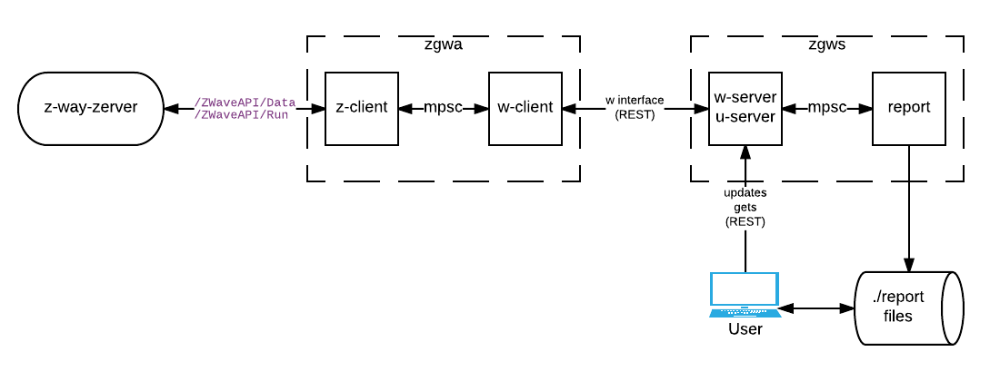
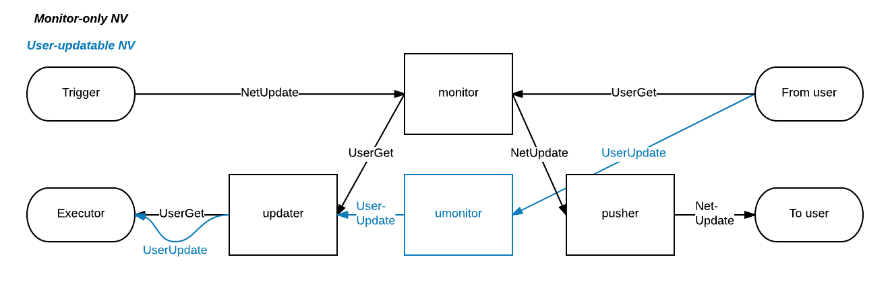

# zgw

ZGW monitors and controls Z-Wave devices on a Z-Wave network managed by Razberry Z-Wave controller.

This software is currently a POC, designed to explore feasibility and costs of developing HA software using compiled, statically 
typed language (Rust), instead of ubiquitous JavaScript. Currently it is pretty far from being a feature-complete product.

## Architecture

### Distributed system

ZGW consists of two software components:

1. ZGW Agent (`zgwa`) runs as close as possible to the `z-way-server` process, typically on the same Razberry 
controller. It pulls the zwave tree from the `z-way-server` process, then pushes select devices upstream.
2. ZGW Server (`zgws`) collects amd processes updates from the ZGW Agent, and provides UIs for monitoring 
and control.



### Client NetVars and message passing



## Configuration

Configuration is provided via YAML files.

### Agent-- Sample configuration

```yaml

---
g: 
  log_file: ~
  log_level: info
  daemonize: true
d: 
  pid_file: ~
  chown_pid_file: ~
  user: ~
  group: ~
  group_n: ~
  umask: ~
z: 
  delay_s: 0
  period_min_s: 5
  period_max_s: 60
  sd: 
    SURL: 
      - "https://secure.zway.url/ZWaveAPI"
      - 
        username: billy
        password: "*"
w: 
  max_send_count: 64
  period_long_s: 60
  period_short_s: 5
  delay_error_s: 120
  sd: 
    Files: "*"
c: 
  - 
    WireMonitoring: 
      name: "PIR-Kitchen-Temp"
      trigger_mp: devices.4.instances.0.commandClasses.49.data.1.val
      ot: 
        device_id: 4
        instance_id: 0
        command_class: 49
  - 
    WireMonitoring: 
      name: "TS-Kitchen-Temp"
      trigger_mp: devices.16.instances.0.commandClasses.49.data.1.val
      ot: 
        device_id: 16
        instance_id: 0
        command_class: 49
  - 
    State: 
      name: "SW-Restroom.updater"
      state: 
        Updater: 
          t: SwitchBinary
          ot: 
            device_id: 13
            instance_id: 1
            command_class: 37
  - 
    State: 
      name: "SW-Restroom.monitor"
      state: 
        Monitor: {}
  - 
    MountTrigger: 
      trigger_mp: devices.13.instances.1.commandClasses.37.data.level
      monitor: "SW-Restroom.monitor"
  - 
    Link: 
      from: "SW-Restroom.monitor"
      to: "SW-Restroom.updater"
  - 
    MountTrigger: 
      trigger_mp: devices.16.instances.0.commandClasses.67.data.1.setVal
      monitor: "TS-Kitchen-SetPoint-Set"
  - 
    MountTrigger: 
      trigger_mp: devices.16.instances.0.commandClasses.67.data.1.val
      monitor: "TS-Kitchen-SetPoint-Val"
```

## Configuration details

### Specifying URLs

URLs are specified for z and w interfaces.

#### 1. Pseudo-input/output

Feeds from files in the specified directory (starting from `0.json`) into z-interface.

Logs outgoing messages on w-interface.

Command-line options: `--z-files <dirpath>`, `--w-files <ignored>`

Configuration (keys: `z.sd`, `w.sd`):
```yaml
  sd: 
    Files: ../data
```

#### 2. HTTP URL

Command-line options: `--z-url <url>`, `--w-url <url>`

Configuration (keys: `z.sd`, `w.sd`; the following example URL is meant for `z.sd`):
```yaml
  sd: 
    URL: "http://non.secure.url.example.com/ZWaveAPI"
```

#### 3. Secure (HTTPS) URL

Secure connector supports optional Basic HTTP Authentication. Username may be specified either in the configuration file or on the command line; password may be specified in the configuration file, on the command line, or in the password file (the password file is recommended). 

Command-line options: `--z-secure-url <url>`, `--w-secure-url <url>`

If used on the command line, username (`--username <u>`) and password (`--password <p>`) options are placed before URL options they attribute to.

Configuration (keys: `z.sd`, `w.sd`; the following example URL is meant for `z.sd`):
```yaml
  sd: 
    SURL: 
      - "https://secure.url.example.com/ZWaveAPI"
      - 
        username: billy
        password: "*"
```
When the value of `*` is specified in the password field, the actual password is taken from the password file.

The username/password section is optional. This is how the Secure URL setting with credentials omitted looks like:

```yaml
  sd: 
    SURL: 
      - "https://secure.url.example.com/ZWaveAPI"
      - ~
```

#### Password file

Upon startup, `zgwa` looks for a file in the CWD named `.zpasswd`. If present, the file is read and parsed as following.

Each line of the password file should have three whitespace-separated fields:

1. URL
2. Username
3. Password (cleartext)

The password file is looked up by (exact) URL and username, when `*` is specified as password in the configuration file or on the command line.

The following example shows how the password `secret` is stored, for the above configuration example:

```text
https://secure.url.example.com/ZWaveAPI billy secret
```
